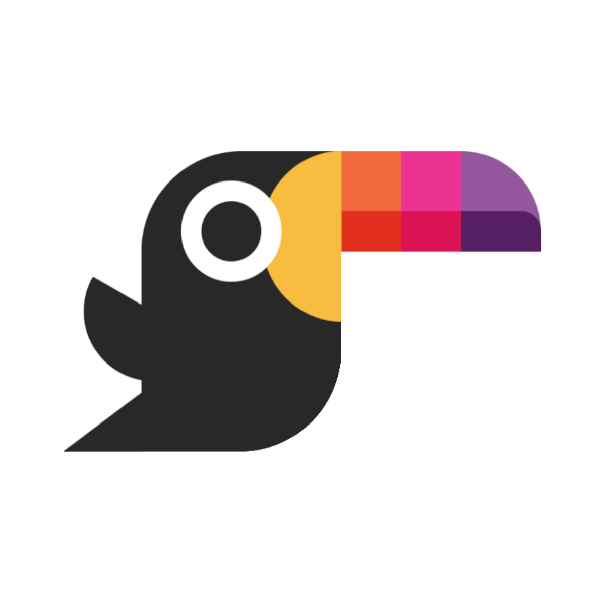

<h1 align="center">Toucaan—A Mutative Design Framework</h1>

  
   
  <h3>
    <a href="https://bubblin.io/cover/the-toucaan-framework-by-marvin-danig">Read the Superbook on iPad.</a>
  </h3>

## Introduction

Toucaan is a _mutative_ design framework for the
[new landscape](https://bubblin.io/blog/the-new-landscape-of-the-web)
of the web.
Mutative here means that you can add/edit 'app styles' directly into
the [baseline normalize](https://bubblin.io/blog/baseline-css)
provided by the framework.

Toucaan is powered with modern-day css patterns (circa 2020, if you
missed the reference of time). It uses css grids, flexbox
and block-scoped typography under the hood.

Create kickass performant UIs with deterministic layouts and
geometric scaled typography. Keep your styles semantic, searchable
and mathematically grounded.

## Getting Started

Head over [here](https://www.toucaan.com/docs/getting-started).

## Key features

1. Semantic layouts with CSS Grids.
2. Block-scoped typography for Intrinsic Design.
3. Support for Apple Watch 5 and upwards
4. Powerful reusable class utilities. It's like writing style in natural English.
5. Easy to customize and theme friendly.
6. Opinionated with real-life usage and feedback.

## Why call it Toucaan?

Quite simply because I owned the pretty domain name.

Besides, Toucan is a beautiful bird. This aggressive little arboreal _ramphastidus_ symbolizes both beauty and strength. We are not only going to found our CSS framework on the metaphor of this highly social and resilient bird but also implement a design language that covers support for all devices on the web including but not limited to just mobile phone or desktops.

Occasionally, though only rarely, we may spar with other CSS frameworks using our “mean” oversized and colorful bill. 😉

So… say hello to Toucaan—The Tropical CSS framework for the web.

And repeat after me: **_Because if Toucaan, then you can too!_** 😉

## Table of Contents

1. [Rethinking CSS Frameworks](https://bubblin.io/blog/toucaan-introduction)
2. [A New Baseline.CSS with Responsive Typography](https://bubblin.io/blog/baseline-css)
3. [Web Designing for the Apple Watch](https://bubblin.io/blog/web-design-recommendations-for-the-apple-watch)
4. [The New Landscape of The Web](https://bubblin.io/blog/the-new-landscape-of-the-web)
5. [Mapping pixels to inches correctly]()
5. _Switch Media Query Explained_

