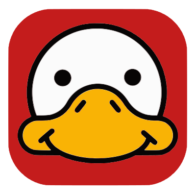
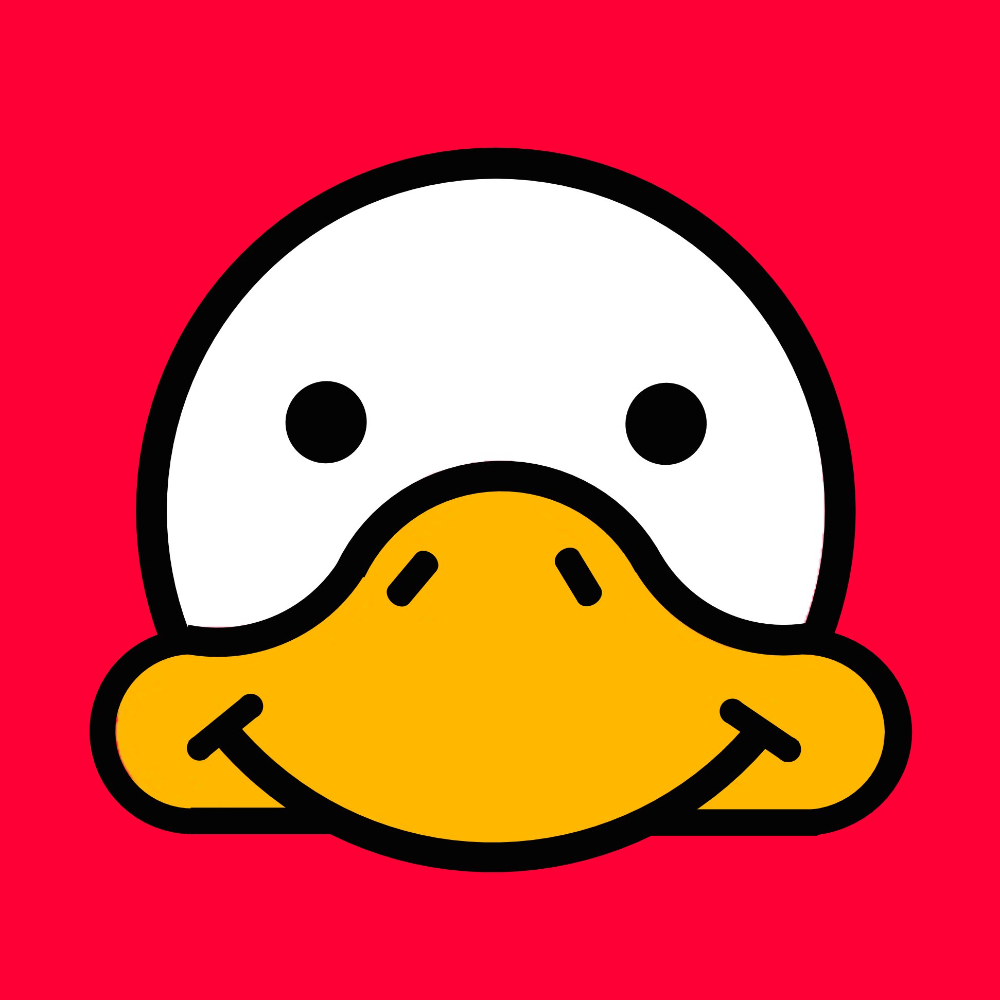

<div align="center">
    <a href="https://toucaan.com" rel="follow">
        
    </a>
</div>

# Introduction

Toucaan is an _intrinsic_, _mutative_, and _deterministic_ CSS framework for the web _and_ mobile apps using the `webView.`

### Definitions

1. **Intrinsic** implies that your app design "belongs" to the device in question naturally. The term `intrinsic` was [coined](https://www.zeldman.com/2018/05/02/transcript-intrinsic-web-design-with-jen-simmons-the-big-web-show/) by Jen Simmons of Mozilla back in 2017. While intrinsic could mean different things to different people, it really points to "app-like" interfaces that belong to the user device.

2. **Mutative** implies that you can edit and add to baseline rules (think customized `normalize.css`) yourself. Directly into the framework. This concept borders close to the idea of a classless & framework-less approach to web design. There is no single heavy `reset` or `normalize` or an external utility included in the DOM to enforce browser consistency.

3. **Deterministic** means applying style without approximations or any sort of guesswork about the UI container. Put simply, a layout can "belong" to a device only when the layout _knows_ the kind of device it is on.

Learn more about how Toucaan uses a [CSS Router](https://bubblin.io/blog/a-css-router) to serve category-specific stylesheets (watch → mobile → tablet → desktop → television…) instead of hardcoded media-queries.

---

<div align="left">
  <p>
    <span>
      <a href="https://goose.red" rel="follow">
         
      </a>
    </span>
    Brought to you by 
      <a href='https://goose.red'> Red Goose.
      </a>
  </p>
</div>

> The world's fastest website → app conversion engine.
>
> Create mobile apps written in Swift or Kotlin and help small dev teams get on the app stores quickly.

---

### About

Design "app-like" interfaces. Toucaan is meant for building web-apps and mobile-apps using the building blocks of the web, i.e., HTML, CSS, JavaScript, and WebAssembly. 🏅

Toucaan is about:

- Optimizing UX/UI according to a device, its underlying capabilities (e.g.: `pointer: coarse /fine`), physical size, and other situational constraints.
- Putting accessibility above everything else.
- Routing stylesheets according to the [new landscape of the web](https://bubblin.io/blog/the-new-landscape-of-the-web). 

Toucaan uses several ultramodern CSS patterns that are grounded in mathematics. It introduces some new concepts like:

1. Using `vmin` for block-scoped typography and intrinsic aspect-ratios instead of the regular units like `px` `em` or `rem`,
2. Optionally use absolute [--inch](https://github.com/bookiza/--inch) unit or any other SI unit of physical measurement like centimeters or millimeters to define your UI.

And much, much more…

> Read more about how Toucaan came about to be over [here](https://bubblin.io/blog/toucaan-introduction).

### Key features

1. Intrinsic in principle and design.
2. Block-scoped typography using `vmin`.
3. Deterministic UX/UI `vmin` or `inch: pixel` mappings (Optional).
4. Supports Apple Watch 5 and upwards, up to projectors & OLED TVs.
5. Simple yet classy utilities. It's like writing style in plain English.
6. Accessibile by default.
7. CSS architecture that's grounded in mathematics.
8. Super customizable and themable.
9. Zero resetting or bulldozing vendor consistency. 
10. Follows native UI patterns for mobile-app interfaces.

#### Basic concepts

1. [Rethinking CSS frameworks](https://bubblin.io/blog/toucaan-introduction)
2. [A new baseline](https://bubblin.io/blog/baseline-css)
3. [Web designing for the Apple Watch](https://bubblin.io/blog/web-design-recommendations-for-the-apple-watch)
4. [The new landscape of the web](https://bubblin.io/blog/the-new-landscape-of-the-web)
5. [Mapping pixels to physical inches?](https://bubblin.io/blog/inch)
6. [Writing a Router in CSS](https://bubblin.io/blog/a-css-router)
7. [Intrinsic Typography and Aspect Ratio with VMIN units](https://bubblin.io/blog/magical-powers-of-css-vmin-unit)
6. _Switch Media Query Explained_
7. _Understanding Intrinsic Web Design_

## Getting started

The first step of setting up Toucaan on your project is to remove _all_ instances of the line below from the head tag of your document:

```css
  <link rel="stylesheet" href="path/to/app.css" />
``` 

Toucaan does not use a `link.rel` directive to import the stylesheets. Instead it uses a singular css `@import` call from within a `<style> </style>` tag, like so:

```html
<!doctype html>
<html>
<head>
  <!--Regular head stuff-->
  <style> 
    @import url('/route/to/app.css') only screen and ( /* Some conditions here. */ );
  </style> 
</head>
<body>
  <!-- Add your site or application content here -->
  <div id="app">Hello world! This is HTML5 Boilerplate.</div>
  <script src="route/to/app.js"></script>
</body>
</html>
```

Head over [here](https://www.toucaan.com/docs/getting-started) to get started. We are looking for help on documentation and contributors for this project. 

Feel free to submit a PR or write to me if you want to join the core team.

### Vendor Support

Modern browsers that are inside of 2017 and now. The support can go further back, but check-out [CSS Remedy](https://github.com/jensimmons/cssremedy)
to see how much debt you're willing to shoulder for backward-compatibility.


### Financial support

If you like my [work](https://github.com/sponsors/marvindanig) please consider supporting it financially.

#### The Superbook

> I'm writing a book on the [Fundamentals of Toucaan CSS](https://bubblin.io/cover/the-toucaan-framework-by-marvin-danig) that will explain the thoughts and the reasoning behind the choices made by Toucaan and how you could override them.

#### Sponsors
Current sponsors of Toucaan: 

<div align="left">
  <a href="https://goose.red" rel="follow">
     
  </a>
</div>


#### Why call it Toucaan?

Only because I owned the pretty domain name. 

Besides, Toucan is a beautiful bird. This aggressive little arboreal _ramphastidus_ symbolizes both beauty and aggression. What better animal to ground our framework's central metaphor on? 

You see **_if Toucaan, then you can too!_** 😉

## License

MIT or PPL. 