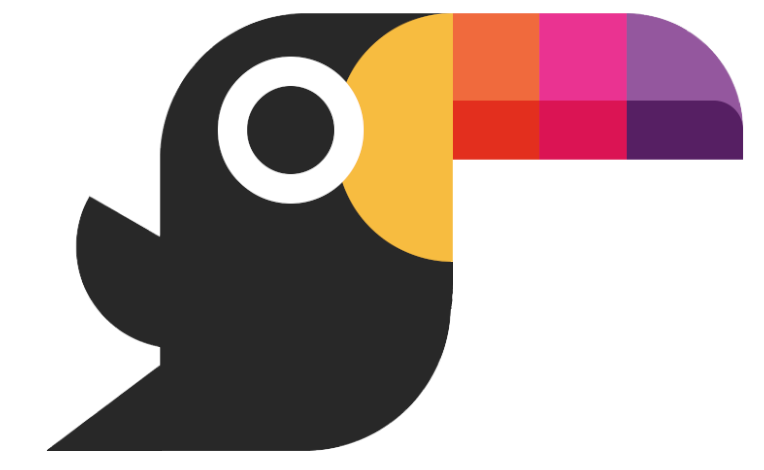

<h1 align="center">Toucaan—A Tropical CSS Framework</h1>

  
   
  <h3>
    <a href="https://bubblin.io/cover/the-toucaan-framework-by-marvin-danig">Read the Superbook on iPad.</a>
  </h3>

## Why Toucaan?

Toucaan is full of *fun facts*, interesting patterns and great documentation to style the apps of the new world. It is easy and logical, and tries to get out of the way as soon as it can. 

Repeat after me: **_If Toucaan, then you can too!_**

## TODOs:

1. Set up a documentation website via netlify (repo [here](https://github.com/bookiza/toucaan.gatsby.site). Immediate help required on this!) 
2. Typesetting/layout still improper on the [Superbook](https://github.com/marvindanig/toucaan-story-of-style). 
3. A place where people can opiniate/scream etc.
4. Test suite?
5. Sem-Ver? 

### A humble beginning… and a plan.

Did you know that the most responsive page in the whole world wide web is *[blank](examples/example1.html)*. Yes, we'll start from here. And never tell the browser to do something that it is already doing!

Yep. Minimal code, fewer (if any) hardcoded values and an intrinsic _spandex style_ rubbery typography that scales naturally on every device. This is the plan.

Let's see how far we can get with it.

### Why Toucaan, you may ask again?

Well, quite simply because I owned the pretty domain name.

Besides, Toucan is a beautiful bird. This aggressive little arboreal ramphastidus symbolizes both beauty and strength. We are going to base our CSS framework on this highly social and resilient bird to implement a styling stricture that will cover all wilderness on the web.

Ocassionally—though rarely—we may even spar with other CSS frameworks using our “mean” oversized and colorful bill. 😉 

Say hello to Toucaan—a tropical CSS framework for the web.

Let's get on with the [introduction](posts/2019-09-30-toucaan-introduction.md).
