    

# Introduction

Toucaan is an _intrinsic_, _mutative_, and _deterministic_ CSS framework for the web _and_ mobile apps using the `webView.`

Design "app-like" interfaces. 

Optimize UX/UI according to device capabilities and physical size.
Separate stylesheets according to the [new landscape of the web](https://bubblin.io/blog/the-new-landscape-of-the-web). 
Put Accessibility ahead of everything else.
Use block-scoped typography with `vmin` instead of `px`, `em`, `rem` or `vw/vh` which are hard to scale.
Read more about why and how Toucaan came about to be over [here](https://bubblin.io/blog/toucaan-introduction).

## Definitions

1. **Intrinsic** implies that your app design "belongs" to the device in question naturally. The term `intrinsic` was [coined](https://www.zeldman.com/2018/05/02/transcript-intrinsic-web-design-with-jen-simmons-the-big-web-show/) by Jen Simmons of Mozilla back in 2017. While intrinsic could mean different things to different people, it really points to "app-like" interfaces that belong to the user device.

2. **Mutative** implies that you can edit and add to baseline rules (think customized `normalize.css`) yourself. Directly into the framework. This concept borders close to the idea of a classless & framework-less approach to web design. There is no single heavy `reset` or `normalize` or an external utility included in the DOM to enforce browser consistency.

3. **Deterministic** means without any guesswork or approximations of the container or the viewport. Put simply, a layout can "belong" to a device only when the layout _knows_ what device it is being viewed on. Learn more about the CSS Router that Toucaan utilizes to serve category-specific stylesheets (watch => mobile => tablet => desktop => television) instead of hardcoded media-queries that match to a device-width.

Toucaan uses several ultramodern CSS patterns that are grounded in mathematics. It also introduces some new concepts like:

1. Using `vmin` for block-scoped typography and intrinsic aspect-ratios,
2. Optionally use absolute [--inch](https://github.com/bookiza/--inch) unit or any other physical SI unit like centimeters or millimeters to define your UI.
3. And much, much more…

### What Toucaan doesn't say

Toucaan is careful about avoiding tribalistic positions that developers often take. It doesn't subscribe to a view that says 'use this, but not that', like _not_ choosing between CSS grids, flexbox, or floats. 

Use whatever you like, wherever you want; however, you may deem it fit.

### Table of Contents

1. [Rethinking css frameworks](https://bubblin.io/blog/toucaan-introduction)
2. [A new baseline.css](https://bubblin.io/blog/baseline-css)
3. [Web designing for the Apple Watch](https://bubblin.io/blog/web-design-recommendations-for-the-apple-watch)
4. [The New landscape of the web](https://bubblin.io/blog/the-new-landscape-of-the-web)
5. [Mapping pixels to physical inches!](https://bubblin.io/blog/inch)
6. [Intrinsic CSS Router](https://bubblin.io/blog/a-css-router)
7. _Blockscoped Typography and Aspect Ratios in CSS_
6. _Switch Media Query Explained_
7. _Intinsic Web Design_

### Financial support

If you like my work and would love to support:

#### One night stand

> You can also buy the book on the [Fundamentals of Toucaan](https://bubblin.io/cover/the-toucaan-framework-by-marvin-danig) that explains the thoughts and reasoning behind the choices made by Toucaan and how you could override them.

#### Github Sponsorship

### Documentation

Head over [here](https://www.toucaan.com/docs/getting-started).

### Key features

1. Semantic layouts with CSS Grids.
2. Block-scoped typography
3. Deterministic layouts with `inch:pixel` mappings (Optional).
4. Supported Apple Watch 5 all the way up to large projectors & OLED TVs with a modern browser.
5. Powerful and yet simple reusable classes. Like writing style in plain English.
6. Easy to customize and theme-ify.

### Browser Support

Preferably modern browsers that are inside of 2017 and now. Check-out [CSS Remedy](https://github.com/jensimmons/cssremedy)
to see how much debt you're willing to undertake for backwards-compatibility.

### Why call it Toucaan

Quite simply because I owned the pretty domain name.

Besides, Toucan is a beautiful bird. This aggressive little arboreal
_ramphastidus_ symbolizes both beauty and strength. We are not only going to found
our CSS framework on the metaphor of this highly social and resilient bird but also
implement a design language that covers support for all devices on the web including
but not limited to mobile or the desktop.

Occasionally, though only rarely, we may even spar with other CSS frameworks
using our "mean" oversized and colorful bill. 😉 So… say hello to Toucaan—the tropical new CSS framework for web apps. 

And repeat after me: **_if Toucaan, then you can too!_** 😉

### Sponsored by

[Red Goose](https://goose.red)–world's number one website to mobile app converter.